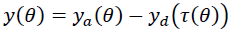

# review-sim-amber-robot
A review and simulation of "First Steps Toward Underactuated Human-Inspired Bipedal Robotic Walking", paper from AMBER Lab

This repository contains the a review and a simulation of the paper “First Steps Toward Underactuated Human-Inspired Bipedal Robotic Walking” form Amber LAB, https://ieeexplore.ieee.org/document/6225360.

AMBER robot has 5 links, 2 legs, 2 shanks and the torso, and it's actuated at boths hips and both knees. It's an underactuated robot.

In the paper, they collect data from angles of people walking, make some affine transformations and apply optimization in order to make regression to the new variables. They have the form:

But here comes the difference from classic tracking. Let *y~a~(t)* be the vector containing the variables of the system, and *y~d~(t)* the desired vector function obtained by regression on *y~H~(t)* (only last 4 trajectories). The control law doesn't exactly drive the error between *y~a~(t)* and *y~d~(t)* obtained by regression, but the law control wants to drive the following error function to *0*.

Where:

They do this based in the fact that the position of the hip seems to evolve linear with time, with constant velocity *v~hip~*. The position of the hip is independent of the 4 variables tracked, so this corresponds to the Zero Dynamics. There is no guarantee that the Zero Dynamics will behave linearly and growing, so in order to force this, an optimization in the regression is performed, imposing conditions that define a hybrid limit cycle under collision.

This optimization ensures the existence and stability of the hybrid limit cycle, ensures that the position of the hip will grow, although it doesn't force exactly that the position must grow linearly. But it ensures the hybrid limit cycle, so underactuated walking is achieved.

However, the hip position in the simulation finally appears to grow linearly. This, in fact, is possible because the system behaves like an inverted pendulum with initial velocity *v~hip~* on the hip (this is part of the second restriction), but the global center of mass is close to the vertical line, so the torque applied at the ankle by gravity is almost *0*, and the velocity remains almost constant.

From this, we can compute the approximate value of *tau*:

Ideally we have *tau=t*, but this not *\tau* \tau $tau$ $$tau$$ $$\tau$$ *$$\tau$$* $$\tau$$ *$$tau$$*

